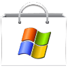

<div align="center">



# Reborn XP App Market

</div>


Welcome to the official, community-driven App Distribution Platform for **Reborn XP**, the web-based Windows XP simulator. This repository hosts the application database, icons, and bundles that power the App Market application inside the OS.

## Table of Contents
*   [How to Submit a New App](#how-to-submit-a-new-app)
*   [How to Publish an Update](#how-to-publish-an-update)
*   [Submission Requirements](#submission-requirements)
*   [For Reborn XP Users](#for-reborn-xp-users)
*   [License](#license)

## How to Submit a New App

We welcome and encourage developers to submit their own applications to the market. The process is managed entirely through GitHub Pull Requests.

### Step 1: Develop & Test Your App
Before submitting, you must build and test your application using the official **[Reborn XP SDK](https://github.com/Quenq-Systems/reborn-xp-sdk)**. The SDK provides a complete workflow for developing and testing your app's full installation process, ensuring it will work correctly for end-users.

### Step 2: Prepare Your Assets
You must prepare these key assets:

1.  **App Bundle (`.zip`):** This is your application's code and assets. The zip bundle **must** contain your files at the root level. **Do not zip the parent folder.**
    *   **Example:** For a project in a folder named `my-game/`, you must open the folder, select all the files inside it (e.g., `app.js`, `index.html`), and create the zip file from those contents.

2.  **App Icon (`.png`):** This is the icon displayed in the App Market listing. It must be a **100x100** pixel PNG file.

3.  **Featured Image (`.jpg` - Optional):** If you wish for your app to be featured on the market's main page, provide a **700x300** pixel JPG banner image.

### Step 3: Add Your App to This Repository

1.  **Fork** this repository (`app-market`) to your own GitHub account.
2.  In your forked repository, upload your prepared assets to the correct directories:
    *   `/bundles/`: Your `.zip` app bundle.
    *   `/icons/`: Your `100x100` `.png` icon.
    *   `/featured/`: Your optional `700x300` `.jpg` banner.
3.  **Edit `apps_db.json`** and add the JSON object for your application to the end of the array.

#### `apps_db.json` Entry Template
All fields are mandatory unless marked optional. All URLs must be absolute paths to `https://quenq-systems.github.io/app-market/`.

```
{
    "id": "your-app-id",                // A unique, lowercase, no-spaces identifier.
    "displayName": "Your App Name",     // The name displayed in the market.
    "author": "Author Name",            // Your Name or Company.
    "authorUrl": "https://your-website-or-github.com", // Link to your website or GitHub repository.
    "description": "A brief, engaging description of what your app does.",
    "version": "1.0",                   // The initial version of your app.
    "category": "Games",                // e.g., "Games", "Multimedia", "Internet", "Utilities" etc.
    "iconUrl": "https://quenq-systems.github.io/app-market/icons/your-app-id.png", // A 100x100 icon for your app.
    "featuredImage": "https://quenq-systems.github.io/app-market/featured/your-app-id.jpg", // Optional, `null` if not used.
    "featured": false,                  // Should be `false`. The maintainers will decide if an app is featured.
    "bundleUrl": "https://quenq-systems.github.io/app-market/bundles/your-app-id.zip",
    "fileAssociations": [],             // Optional: file extensions your app can open. e.g., ["csv", "pdf"]
    "config": {
        "coreJsFilename": "your-app.js" // The name of the main JavaScript entry file inside your bundle.
    }
}
```

### Step 4: Submit a Pull Request
Once your assets are uploaded and `apps_db.json` is updated, submit a **Pull Request** from your forked repository to `Quenq-Systems/app-market`. We will review it for approval.

## How to Publish an Update

To publish an update for an app that is already in the market:

1.  **Update Your App Files:** Make the desired changes in your application's code and assets.
2.  **Create a New Bundle:** Zip the updated files and **replace the old `.zip` file** in the `/bundles/` folder of your forked repository.
3.  **Increment the Version Number:** This is the most important step. In `apps_db.json`, find your app's entry and update the `version` string (e.g., from `"1.0"` to `"1.1"`). This change is what enables the "Update" button for existing users.
4.  **Submit a Pull Request:** Submit a new PR with your changes. Use a clear title, for example: `[UPDATE] Your App Name v1.1`.

## Submission Requirements
- **Self-Contained:** All community-submitted apps must be self-contained within a `.zip` bundle.
- **Functionality:** Your application must be fully functional within the Reborn XP environment.
- **Safety:** Content must not be malicious, harmful, or violate any laws.
- **Optimization:** Keep your bundle size as reasonable as possible.

## For Reborn XP Users
You can access all the apps listed here by opening the **Start Menu**, clicking **All Programs**, and launching the **App Market** application inside Reborn XP.

## Licensing and Submission Terms

### Repository License
The structure and code of this repository are provided under the **MIT License**.

### Application Licenses
**Each application bundle is the property of its respective developer (as listed in the `author` field) and is governed by its own license.** The MIT license of this repository does not apply to the contents of the app bundles themselves. Most submissions are compiled/minified web app builds, not raw source code. It is the developer's responsibility to include any end-user license agreements within their application if they choose.

By submitting an application to this repository, you (the developer) grant Quenq Systems a non-exclusive, royalty-free license to distribute your application bundle via the Reborn XP App Market.